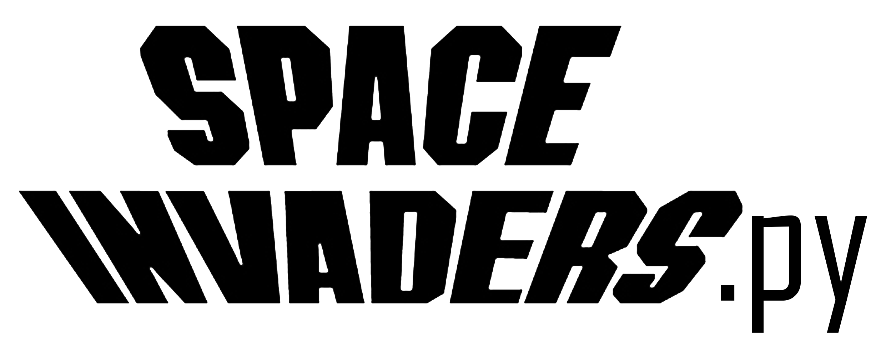
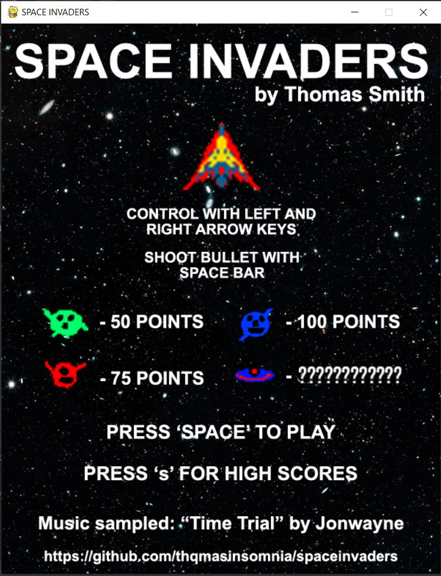
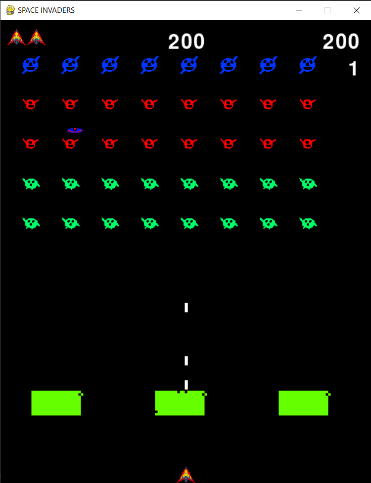
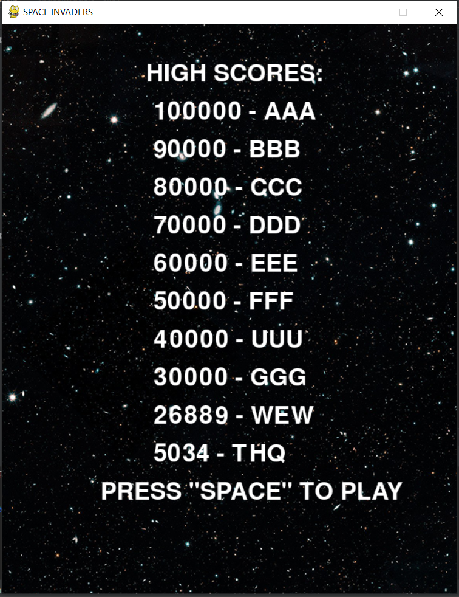

##

##

<p align=center><strong>SPACE INVADERS WRITTEN IN BEAUTIFUL PYTHON</p></strong>

Namco's classic game <i>Space Invaders</i> written in Python. Developed for my Intro to Game Design class at Cal State Fullerton.
This project was written in 2 weeks while traveling to Chicago for a wedding in the middle of it. Features a title screen, keyboard input, scoring system,
high score board (that saves between plays), increasing difficulty, destructive bunkers and charector and ship animations. 

Music speeds up and becomes more intense as the level increases with difficulty.

Written using the Pygame Moduel.

This project was built on top of the "Alien Invasion" code from the book <i>Python Crash Course, 2nd Edition</i> by Eric Matthes.
A great and highly suggested read for getting into Python.
https://nostarch.com/pythoncrashcourse2e



<br>
<br>
<br><br>
<br>
<br>

## Programs Used
- Pycharm CE
- Adobe Photoshop CC (layout title screen)
- Piskel (draw sprites)
- Audacity (editing and converting audio samples)

## Requeriments
- [Python](https://www.python.org/) (duh)
- [Pygame](https://www.pygame.org/)

## Controls

- SPACEBAR - PEW PEW

- ARROW KEYS (L/R) - DODGE DODGE

- KEYS KEYS - TYPE YOUR NAME TO FLEX YOUR HIGH SCORE


<br>
<br>
<br>



### Cloning the Repo
```
$ git clone https://github.com/thqmasinsomnia/spaceinvaders
$ cd spaceinvaders
```

### To Play 

```
$ python si.py
``` 
Music sampeled from the track "Time Trial" off <i>Browser</i> by Jonwayne
<br> https://alphapup.bandcamp.com/album/bowser
<br>
<br>This project was written over the span of 2 weeks with a trip to Chicago for a wedding in the middle of it. Thank goodness theres airplane Wi-Fi.
<br>
<br><b> LEGAL: SPACE INVADERS IS OWNED BY NAMCO
<br>PLEASE DON'T SUE ME I JUST WANT A JOB</b>

<h1>👽🚀👽🚀👽🚀👽🚀👽🚀👽🚀👽🚀👽🚀👽🚀👽🚀👽</h1>
